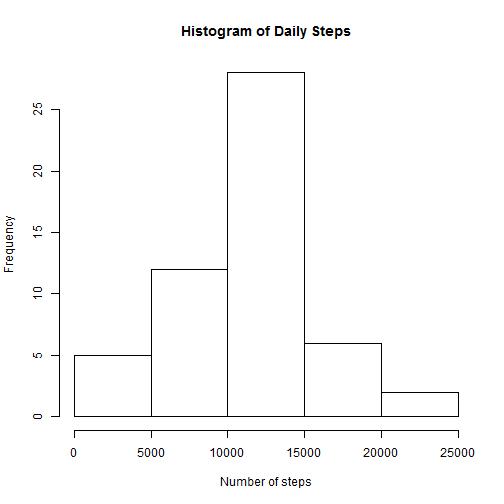
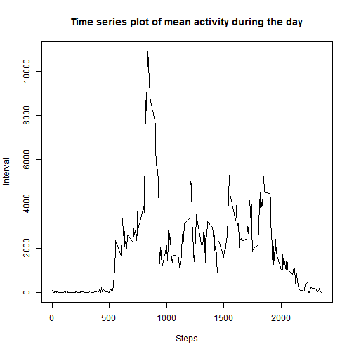
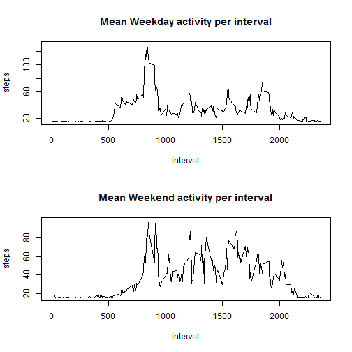

# Reproducible Research: Peer Assessment 1


## Loading and preprocessing the data


```r
data<-read.csv("activity.csv")
```

## What is mean total number of steps taken per day?

```r
sums<-aggregate(steps ~ date, data, sum, na.rm=TRUE)
hist(sums[,2], main="Histogram of Daily Steps", xlab="Number of steps")
```

 


```r
mn<-ceiling(mean(sums[,2]))
meanstr<-sprintf("%d",mn)
md<-median(sums[,2])
```
The mean number of steps each day is 10767.
The median is 10765.


## What is the average daily activity pattern?


```r
timeseries<-aggregate(steps ~ interval, data, sum, na.rm=TRUE)
plot(x=timeseries$interval, y=timeseries$steps,type="l",
 main="Time series plot of mean activity during the day"    ,xlab="Steps",ylab="Interval")
```

 

```r
maxinterval<-timeseries[,1][(timeseries[,2]==max(timeseries[,2]))]
```
The interval with maximum steps is 835

## Imputing missing values

```r
missing<-length(data$steps[is.na(data$steps)])
```

The number of missing values is 2304

```r
newdata<-vector(length=length(data[,1]), mode="numeric")
for (i in 1:length(newdata))
  { newdata[i]<-if (is.na(data$steps[i])) 
    { ceiling(mean(data$steps[data$interval==data$interval[i]],na.rm=TRUE))
    } 
    else 
    {
      data$steps[i]
    } 
  }
newdata<-cbind(newdata,data[,2])
```

```r
sums2<-aggregate(steps ~ date, data, sum)
hist(sums2[,2], main="Histogram of Daily Steps", xlab="Number of steps")
```

 

```r
mn2<-ceiling(mean(sums2[,2]))
meanstr2<-sprintf("%d",mn2)
md2<-median(sums2[,2])
```
The mean number of steps each day is 10767.
The median is 10765.

## Are there differences in activity patterns between weekdays and weekends?

```r
isweekend<-((weeklydata$weekday=="Sunday")|(weeklydata$weekday=="Saturday"))
l=length(data[,1])
weeklydata<-data.frame(weekday=character(l),steps=numeric(l),interval=numeric(l))
weeklydata$weekday=weekdays(as.Date(data$date))
weeklydata$interval<-data$interval
weeklydata$steps=newdata
weekenddata<-data.frame(steps=weeklydata$steps[isweekend],interval=weeklydata$interval[isweekend])
weekdaydata<-data.frame(steps=weeklydata$steps[!isweekend],interval=weeklydata$interval[!isweekend])
tmp<-aggregate(steps ~ interval,data= weekdaydata,mean)
tmp2<-aggregate(steps ~ interval,data= weekenddata,mean)
par(mfrow=c(2,1))
plot(x=tmp$interval,y=tmp$steps,type="l",main="Mean Weekday activity per interval", xlab="interval",ylab="steps")
plot(x=tmp2$interval,y=tmp2$steps,type="l",main="Mean Weekend activity per interval", xlab="interval",ylab="steps")
```

 

Weekday activities concentrated to earlier in the day, weekend activities more uniformly spread.

